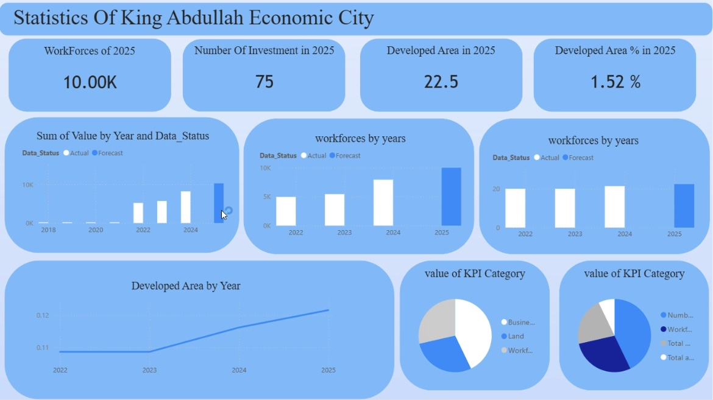
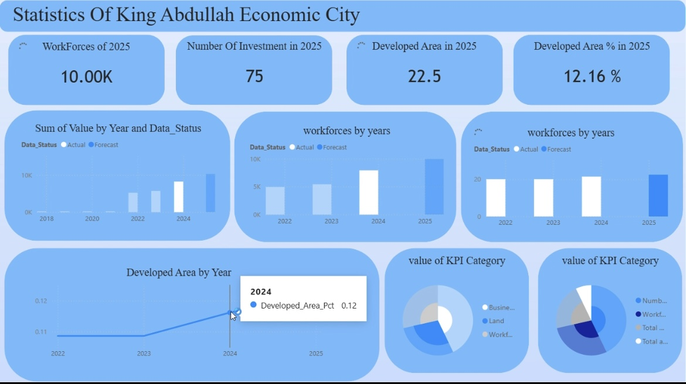
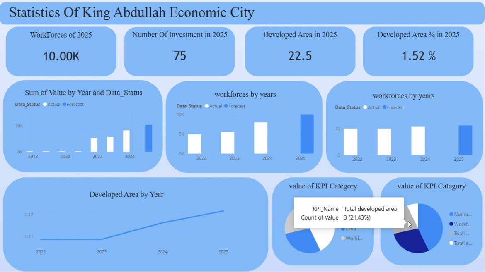

# King-Abdullah-City-Economic-Data-Analysis
Data analysis project for King Abdullah Economic City (KAEC) using Excel and Power BI. The dataset includes key performance indicators (KPIs) such as total area, developed area, workforce, and number of investment facilities for the years 2018–2025, with cleaned data and custom measures for interactive dashboards.
# تحليل بيانات مدينة الملك عبدالله الاقتصادية (2018–2025) باستخدام Power BI

هذا المشروع يستعرض عملية تحليل وتصوير بيانات *مدينة الملك عبدالله الاقتصادية (KAEC)* للفترة من 2018 إلى 2025 باستخدام Excel و Power BI.

## محتوى البيانات

يتضمن الجدول الرئيسي مجموعة من مؤشرات الأداء الرئيسية (KPIs)، من بينها:
- إجمالي مساحة المدينة (Total area)
- المساحة المطوّرة (Total developed area)
- عدد مرافق الاستثمار التراكمية (Number of investment facilities - cumulative)
- حجم القوى العاملة (Workforce)

## هيكل الجدول

تم تنظيم البيانات في شكل طويل (Long Format) يحتوي على الأعمدة التالية:
- `KPI_ID` – رقم المؤشر
- `KPI_Name` – اسم المؤشر
- `KPI_Description` – وصف المؤشر
- `KPI_Category` – تصنيف المؤشر (Land, Workforce, Business)
- `Unit` – وحدة القياس
- `Year` – السنة
- `Value` – قيمة المؤشر
- `Data_Status` – حالة البيانات (Actual / Forecast)

## ما تم عمله

- تنظيف وتنظيم البيانات في Excel
- تحويل البيانات لصيغة مناسبة للتحليل في Power BI
- إنشاء مقاييس (Measures) لمتابعة:
  - قيم آخر سنة (2025)
  - النسبة بين المساحة المطوّرة وإجمالي مساحة المدينة
  - الفصل بين البيانات الفعلية والتقديرية (Actual vs Forecast)
- بناء لوحة معلومات (Dashboard) تفاعلية لعرض نمو المدينة من ناحية:
  - التطوير العمراني
  - جذب الاستثمارات
  - نمو القوى العاملة

يمكن استخدام هذا المشروع كنموذج بسيط لمشاريع تحليل بيانات المدن والمؤشرات الحضرية باستخدام Power BI.
## لقطات من الداشبورد

### 1. نظرة عامة على الداشبورد
هذه الصورة تعرض النظرة العامة للداشبورد الذي يوضح مؤشرات مدينة الملك عبدالله الاقتصادية للفترة من 2018 إلى 2025.

---

### 2. إجمالي القوى العاملة في آخر سنة (2025)
في هذا الجزء يتم عرض كارت/مؤشر يوضح إجمالي عدد القوى العاملة في المدينة لعام 2025، مع الاعتماد على البيانات الفعلية والافتراضية (Actual و Forecast) من نموذج البيانات في Power BI.

---

### 3. المساحة المطوّرة لسنة 2024
هذه الصورة تبين قيمة المساحة المطوّرة في المدينة لعام 2024، كجزء من تتبع تطور المساحة المطوّرة عبر السنوات.

---

### 4. قيمة إجمالي المساحة المطوّرة
في هذا العرض يتم التركيز على إجمالي المساحة المطوّرة مقارنة بإجمالي مساحة المدينة، وذلك لإبراز نسبة الجزء المطوّر من المدينة ضمن الداشبورد.

